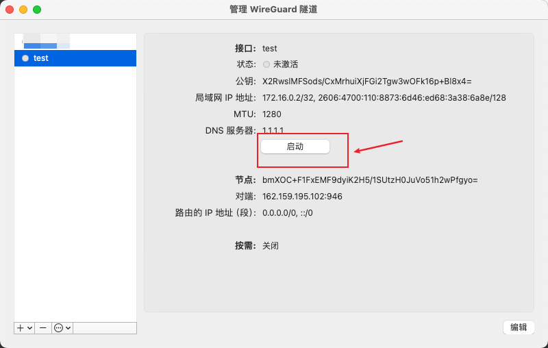

[TOC]

# warp配置

## 一、简介

```yacas
免费VPN最强替代方案，Warp+ 优选IP，真正实现无限的高速流量！无需注册，速度超快！！支持PC、安卓、iOS、macOS、软路由等！
```

## 二、教程

### 1.加入Telegram群组

- https://t.me/generatewarpplusbot
- 请核实好正确的用户名   @generatewarpplusbot
- 

### 2.点击开始或者输入指令 /start

- 第一次直接加入群组时选择开始即可,已经加入则需要输入指令

- 

### 3.点击上面图片的 /generate 选项,并订阅频道

- 
- 订阅上面两个频道 **Warp Plus** 和 **akame.moe enjoyers**
- 订阅完成后点击上述图片 **I have subscribed ** 即可

### 4.再次点击 /generate , 回答对应的问题

- 
- 根据自己的问题去聊天框内输入,注意格式 **/generate 答案**, 例如上述图片需要输入, **/generate 1**

### 5.输入成功后会给你一个秘钥

- 

### 6.下载 wireguard

- 支持Windows、Mac、安卓、iOS等

- 下载链接 https://www.wireguard.com/install/

###  7.下载完成打开,这里以Mac为例

- 新建并保存隧道

  - 
  - 

### 8.生成配置文件

  - 打开网址并点击运行 https://replit.com/@misaka-blog/wgcf-profile-generator?v=1
    - 
  - 运行成功出现以下界面
    - 
  - 输入选项2和刚才在Telegram中的秘钥以及自定义设备名称
    - 
  - 上述3个步骤完成后回车,会生成配置文件
    - 

  

### 9.粘贴配置文件内容到刚才创建的隧道

  - 选择创建好的隧道,进行编辑,复制上面的配置文件内容
    - 

  

### 10.WARP Endpoint IP 优选脚本

- For Windows

  - 下载地址：https://gitlab.com/Misaka-blog/warp-script/-/blob/main/files/warp-yxip/warp-yxip-win.7z

- For MacOS

  - ```shell
    wget -N https://gitlab.com/Misaka-blog/warp-script/-/raw/main/files/warp-yxip/warp-yxip-mac.sh && bash warp-yxip-mac.sh
    ```

- For Linux （包括安卓 Termux 和 iOS 的 iSH）

  - ```shell
    wget -N https://gitlab.com/Misaka-blog/warp-script/-/raw/main/files/warp-yxip/warp-yxip.sh && bash warp-yxip.sh
    ```

  -  安卓 Termux 如无 wget 请使用以下命令安装：`pkg update && pkg install wget`

  -  苹果 iSH 初始命令：`apk add -f openssh bash wget`，如遇更新包卡着不动输入以下命令：`sed -i 's/dl-cdn.alpinelinux.org/mirrors.tuna.tsinghua.edu.cn/g' /etc/apk/repositories`

### 11.脚本使用教程,这里以Mac为例

- 代开终端输运行脚本,输入1回车,需要等待30S左右

  - 

- 复制延迟小的IP

  - 

- 编辑刚才新创建的**wireguard**隧道,替换IP,并保存配置文件

  - 
  - 

  
### 12.启动隧道,测试是否成功

- 
- 


